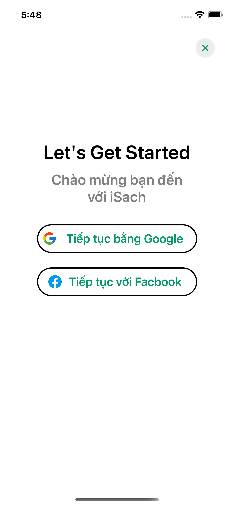
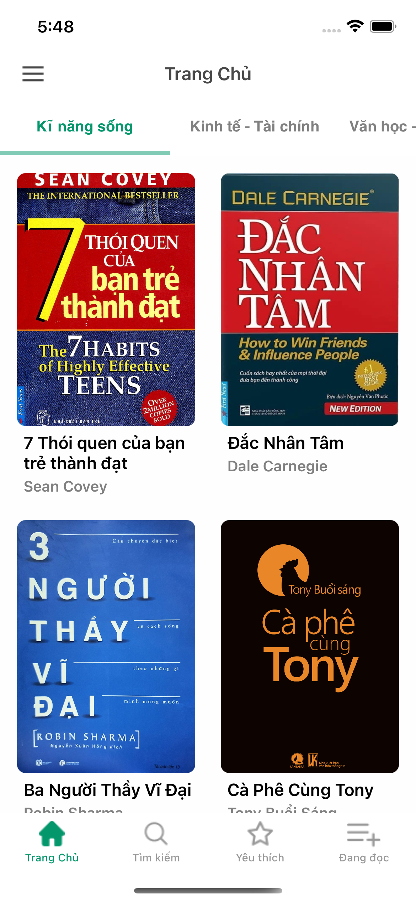
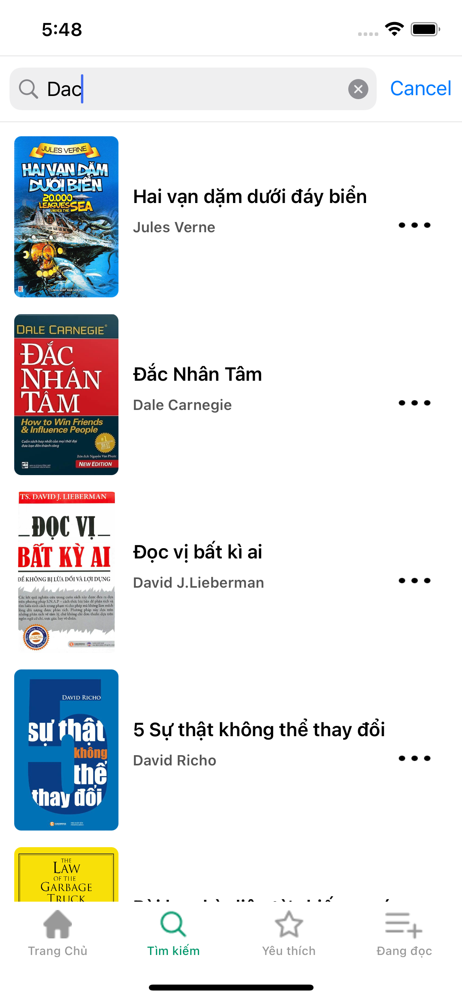
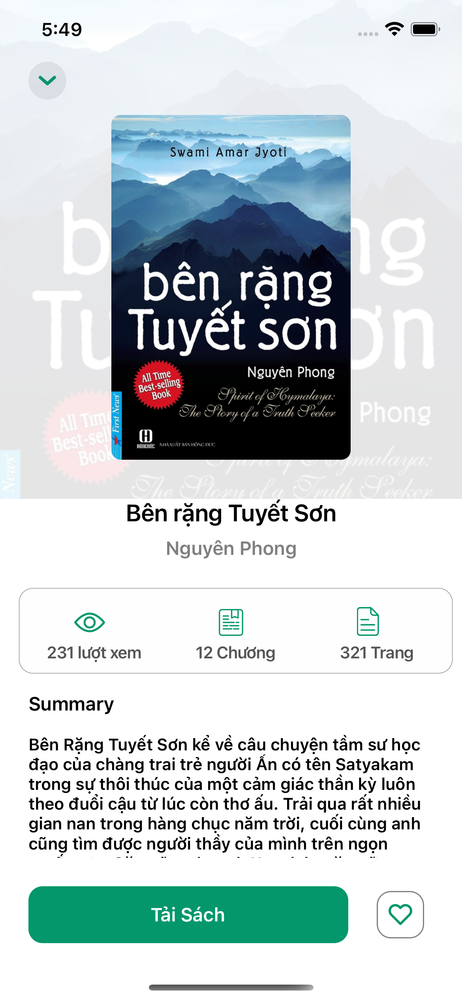
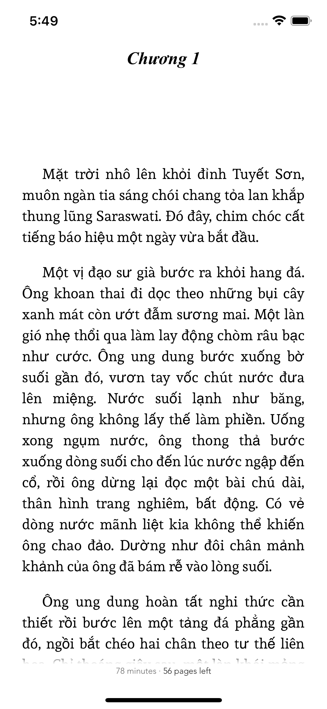
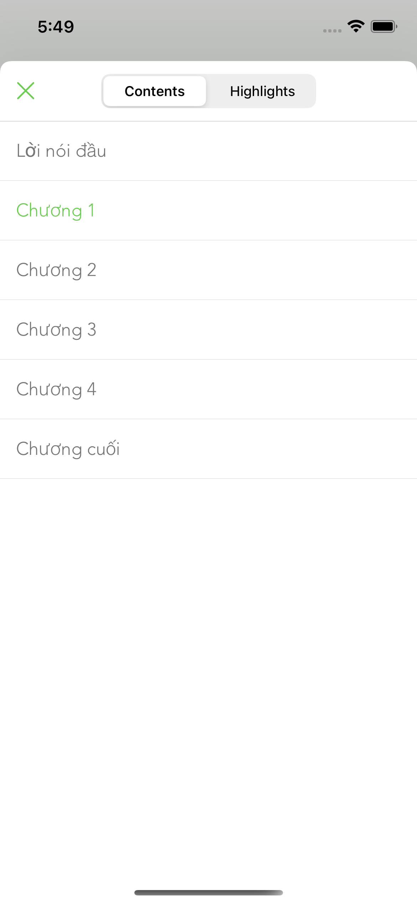

# EpubReader-iOS
an ebook iOS app using Swift


[](https://opensource.org/licenses/Apache-2.0)
[](https://github.com/shameemreza/uray/blob/main/LICENSE)

## Screenshots








## Features

- [x] Custom Fonts
- [x] Custom Text Size
- [x] Text Highlighting
- [x] List / Edit / Delete Highlights
- [x] Themes / Day mode / Night mode
- [x] Handle Internal and External Links
- [x] Portrait / Landscape
- [x] Media Overlays (Sync text rendering with audio playback)
- [x] TTS - Text to Speech Support
- [x] Vertical or/and Horizontal scrolling
- [x] Share Custom Image Quotes **<sup>NEW</sup>**
- [x] Support multiple instances at same time, like parallel reading **<sup>NEW</sup>**
- [x] Book Search
- [x] Add Notes to a Highlight

## License

```
Copyright 2023 leminhcse

Licensed under the Apache License, Version 2.0 (the "License");
you may not use this file except in compliance with the License.
You may obtain a copy of the License at

   http://www.apache.org/licenses/LICENSE-2.0

Unless required by applicable law or agreed to in writing, software
distributed under the License is distributed on an "AS IS" BASIS,
WITHOUT WARRANTIES OR CONDITIONS OF ANY KIND, either express or implied.
See the License for the specific language governing permissions and
limitations under the License.
